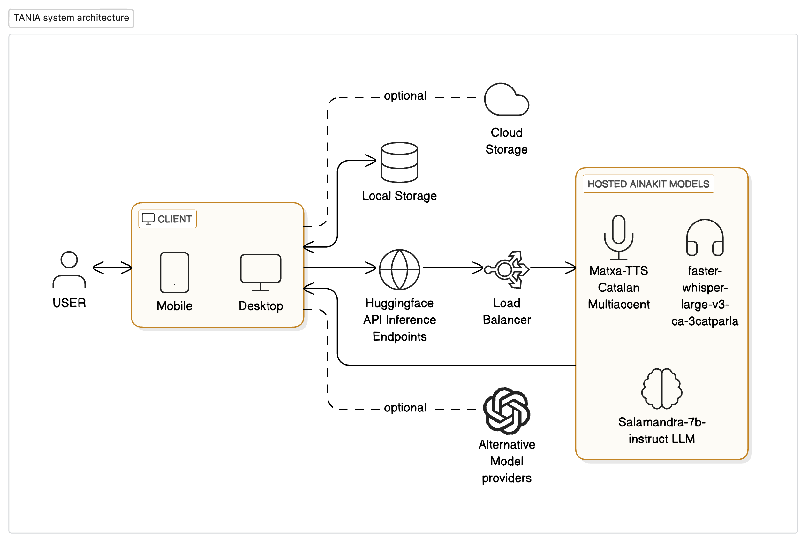
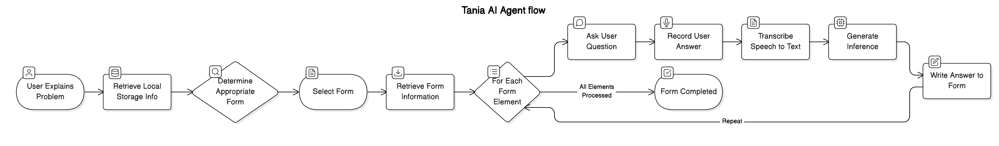
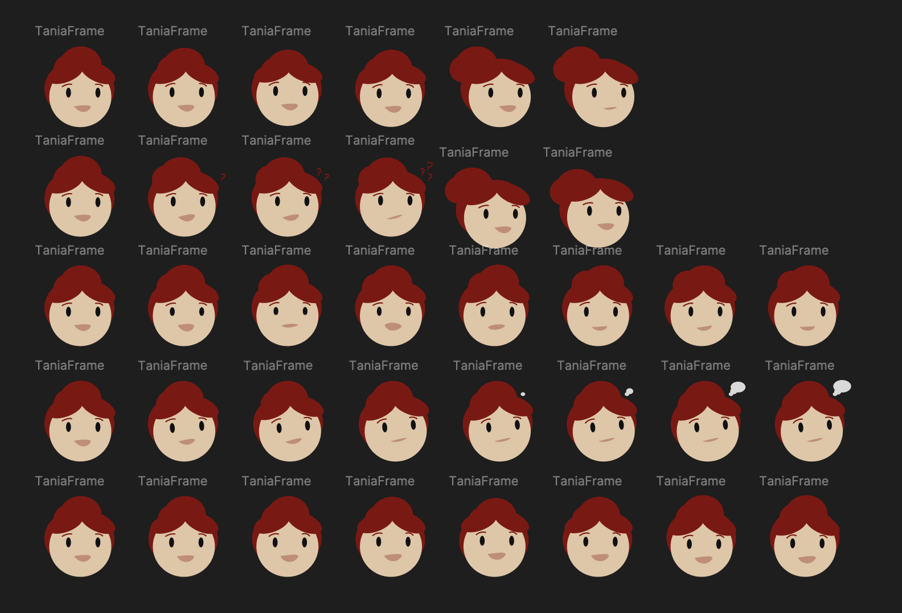

 

---

<p align="center">
  
</p>

# TANIA: Tecnologia d'Assistència Natural per Instàncies Administratives


#### Un projecte participant a l'*Aina Hack 2024* de l'equip *git cat/*

**TANIA** és una demo d'aplicació mòbil i web, representant la visió d'un assistent humanament intel·ligent per a la gestió de tràmits administratius telemàtics.

# image aqui
 
 La missió de TANIA és **millorar i agilitzar la comunicació entre ciutadania i l'administració pública**, mitjançant l'ús del llenguatge natural (amb tota la seva riquesa de dialectes i d'accents) en una interfície moderna, empàtica i accessible. 
 
 És una demostració de l'existència d'una **nova capa d'interacció entre la ciutadania i l'administració pública**, fins ara inexplorada, que creiem que s'implementarà en un futur proper a les administracions públiques d'arreu del món. Un petit tastet del futur, que ja és possible amb la tecnologia oberta del present.

## 🌟 Funcionalitats
### 🔍 **Identificar quin model d'instància s'ha d'emplenar davant d'una situació concreta**.
L'usuari explica el seu problema amb les seves pròpies paraules via veu. TANIA processa aquesta informació i intel·ligentment tria, d'entre tots els models d'instàncies disponibles, el que s'hauria de fer servir per començar a solucionar el problema.

- **Útil per la ciutadania**: De la forma més ràpida possible, sense prendre accions més enllà d'explicar el teu problema en veu alta, TANIA decideix quina és la instància adequada per a la teva situació. **No fa falta conèixer tots els tràmits administratius i per a què serveix cada un**, TANIA ho fa per tu.

- **Útil pels treballadors públics**: Redueix la feina de triar el model d'instància adequat per a cada cas, que és una tasca que requereix 1) un ampli coneixement de tots els tràmits administratius i 2) la capacitat de selecció de la instància més adequada en base al problema explicat (per això fins ara només ho podien fer treballadors humans). **TANIA allibera aquesta càrrega de feina repetitiva.**
  
### 💬 **Emplenar instàncies a partir d'entrevistes**
 Mitjançant una conversa natural, TANIA completa automàticament els camps necessaris de formularis oficials. Funciona com una entrevista, fent preguntes i anotant el model d'instància en base a les resposets. Té el context suficient per anar emplenant els camps de forma completa, formal i detallada; i sap demanar més informació si cal.

- **Útil per la ciutadania**: No cal llenguatge formal i precís, **TANIA emplena instàncies en base al que li expliquis en veu alta "de tu a tu"**. I segueixes poguent modificar qualsevol camp si cal. Molt més ràpid i fàcil que emplenar tots els camps un a un mitjançant un teclat d'ordinador.

- **Útil pels treballadors públics**: Pot reduir el nombre de consultes presencials que fa la ciutadania davant la frustració de triar/emplenar instàncies, a escala (tantes peticions alhora com facin falta). Més destacablement, **TANIA garanteix que TOTS els camps de les instàncies rebudes contenen els detalls necessaris** per a la seva correcta tramitació (ja que segueix entrevistant fins que així sigui), fet que potencialment **redueix l'emissió "esmenes de requeriments" per demanar més informació** als ciutadans.

#### 🚀 Però la millor forma d'entendre-ho és veient-ho en acció:

# video here


## ❓Per què ja és factible implementar TANIA?

> [!IMPORTANT]
> En poques paraules: és **més barat** que la solució actual, i és **fàcil d'incorporar** opcionalment als sistemes actuals.

### 💶 **Cost-efectivitat**
> El cost d'operar el servei de TANIA és ordres de magnitud més baix que el cost en hores de feina humana per a la mateixa tasca. 

Pels motius expostas anteriorment, TANIA estalvia temps a dues bandes, tant dels ciutadans com dels treballadors de l'administració.

Fent estimacions conservadores, el cost de mantenir TANIA en recursos computacionals reservats (targetes gràfiques per a l'inferència de models d'IA de codi obert) és de menys de 5€ l'hora. Per exemple, a data d'avui el *hosting* a AWS de 3 NVIDIA L4 costen 0,80€ l'hora, cada una fent de *host* del model de text a parla, de parla a text, i de processament de text, respectivament.

Aquests recursos poden gestionar múltiples peticions simultàniament, amb disponibilitat 24/7. Amb optimització de recursos, com per exemple utilitzar les mateixes GPUs per a les TANIA de diferents ajuntaments i administracions (per minimitzar el temps en què aquests recursos no es fan servir), aquest cost quedaria repartit entre totes les agències que la fessin servir (una reducció tranquil·lament d'entre 2x a 10x en el cost per agència/administració).

A més, un mateix nivell de poder computacional s'abarateix dràsticament amb el temps, amb reduccions addicionals d'entre 2x a 10x cada any.

I els nous models d'IA són cada cop més eficients, reduint encara més el cost d'inferència.

Combinant aquestes reduccions de cost, el cost de TANIA per cobrir les necessitats de centenars d'ajuntaments i administracions es pot situar tranquil·lament per sota d'1€ l'hora; amb indicatius de que els costos es tornin negligibles durant la propera dècada. Substituïnt desenes, centenars o milers d'hores equivalents de feina humana.

### 🔗 Interoperativitat

> TANIA està dissenyada per produir com a *output* els mateixos *inputs* que els sistemes actuals esperen.

L’output de TANIA es genera en format de text estructurat, com la informació que ompliria un formulari telemàtic. Aquesta informació es pot enviar directament a les API o sistemes interns que ja utilitza l’administració pública per gestionar els tràmits, sense cap necessitat de modificar els sistemes existents.

TANIA actua com una “capa externa” o interfície addicional, que no força cap modificació del que ja existeix, només afegir una forma alternativa de fer-los servir.

---

## ⚙️ Documentació tècnica



### 📊 Components del sistema
- **📱🖥️ Un dispositiu client**, on mostrar la interfície i recollir les explicacions de l'usuari.
- **🗂️📂 Emmagatzematge d'informació**, com la sessió actual o el repositori de models d'instàncies disponibles.
- **🧠🗣️ Inferència de models d'IA**, orquestrant sota el paradigma acutal 3 tipus de models: text a text (LLMs), text a veu (TTS), i veu a text (STT).

##### En la nostra demostració a la Hackathon, vam decidir utilitzar:
- **📱🖥️ Client en forma d'app nativa mòbil i de web**, en forma d'una app universal amb Expo/React Native.
- **🗂️📂 Emmagatzematge local**, utilitzant tant "assets" com llibreries de *state management* com Zustand.
- **🧠🗣️ Self-hosting de models open source**, a HuggingFace Inference Endpoints, pagant per instància/hora.

##### Com a expansió o alternativa, es podria fer servir:

- **📱🖥️ Qualsevol altre tipus de client**, com app VR, smartwatch, TV,...
- **🗂️📂 Emmagatzematge al núvol**, utilitzant una base de dades triant el proveidor i tipus segons la necessitat.
- **🧠🗣️ Consum *serverless* de models d'IA**, tant d'alternatives Open Source com Llama, com plataformes de models comercials (OpenAI, Anthropic,...), per pagar per resposta (preu per token).

## 🔁 Funcionament de la implementació



La TANIA oscil·la entre 4 estats principals: **Pensar, Parlar. Escoltar i Transcriure.** 

Per ocultar els temps d'espera a plena vista i ser més transparents amb aquests diferents estats, l'avatar de la TANIA reprodueix diferents animacions i transiciona entre elles segons l'estat actual. Aquestes animacions s'han dissenyat a partir de l'interpolació de diferents keyframes, com es pot veure a la següent imatge:



En quant a la implementació via codi, la lògica principal s'executa des de la pàgina `index.tsx`(utilitzant `expo-router`), on diferents ***hooks* es subscriuen a canvis d'estat**, i quan aquests canvis es produeixen, cada *hook* condicionalment executa la seva lògica, majoritàriament relacionada amb fer *queries* a les APIs de diferents models d'IA. 

Un cop s'obtenen les respostes, aquestes es processen i es mostren a l'usuari, actualitzant l'estat per fer que el següent *hook* reaccioni amb la seva lògica. Hi ha parts de la lògica que depenen d'accions de l'usuari (clicar botons, parlar,...), i aquestes es gestionen amb canvis d'estat com a esdeveniments.

> [!WARNING]
> Tot i que el plantejament és sòlid, la implementació que vam fer a la hackathon va prioritzar en tot moment la velocitat d'iteració abans que la llegibilitat i bones pràctiques del codi.


Els models d'instància, "formularis a emplenar", són representats dins del nostre sistema en un format JSON enriquit (a `/git_cat-ainahack/prompts/instanceData`), on cada element del formulari conté el seu label, explicació de què espera, una llista d'exemples de resposta, i una referència a si aquest camp pot ser comú amb altres formularis (per guardar el resultat a preferències comunes). Un exemple seria:

```json
[
    {
        "label": "Tipus de pagament",
        "question": "Quin és el tipus de pagament?",
        "examples": ["Multa", "Impost", "Taxa", "Dret públic"],
        "preferencesKey": null
    },
    {
        "label": "Import pagat",
        "question": "Quin és l'import pagat?",
        "examples": ["100€", "200€"],
        "preferencesKey": null
    },
    {
        "label": "Data de pagament",
        "question": "Quina és la data de pagament?",
        "examples": ["01/01/2023", "15/05/2023"],
        "preferencesKey": null
    }
]
```

La creació d'aquests formats enriquits es pot fer tant de forma manual, com automatitzar-lo utilitzant models LLM avançats. L'avantatge és que el sistema sap utilitzar qualsevol formulari en aquest format, i pot ser fàcilment ampliat per a nous formularis.

Els *prompts* que guien l'orquestració dels models i les ordres que reben (a `/git_cat-ainahack/prompts/`), guardats com a constants en arxius `.ts`, poden ser editats per ajustar-se al rendiment de diferents models, canviar la forma de funcionar, o fer servir altres idiomes.

---

## 🧪 Replicabilitat: Com provar TANIA

Per provar TANIA al teu entorn local, s'ha de copiar el codi font, compilar-lo a les versions natives (en el cas de iOS i Android, utilitzant Android Studio o XCode), i executar-lo com a "development server" per a provar-lo al teu dispositiu i poder enviar canvis en directe.

1. **Clona el repositori**:
   ```bash
   git clone <URL del repositori>
   ```
   O utilitzant, per exemple, la interfície gràfica de GitHub Desktop/VSCode.

2. **Compilar el projecte a natiu amb Expo (requereix credencials per **Android Studio** o **XCode**)**:
   - Per provar-lo en dispositius natius (Android/iOS):
     ```bash
     npx expo run
     ```
   - Alternativament, amb `eas build`:
     ```bash
     eas build -p <platform>
     ```

3. **Alternativament, prova el projecte al navegador (versió web)**:
   ```bash
   npx expo start
   ```
   Després, prem `'w'` per obrir-lo al navegador en `localhost`.

4. **Crea un fitxer `.env`** a la carpeta arrel (`/git_cat-ainahack/.env`) amb el següent contingut:

   ```plaintext
   EXPO_PUBLIC_HUGGING_FACE_API_URL=
   EXPO_PUBLIC_HUGGING_FACE_TOKEN=
   EXPO_PUBLIC_AINAHACK_ENDPOINT_TOKEN=
   EXPO_PUBLIC_SPEECH_TO_TEXT_API_URL=
   EXPO_PUBLIC_TEXT_TO_SPEECH_API_URL=
   ```

   - Completa les URL i tokens segons el teu entorn d’allotjament de models (implementat aquí amb *HuggingFace Inference Endpoints*, s'hauria de modificar els *hooks* que fan les crides API en cas d'utilitzar un altre sistema d'autentificació).

---

*Aquest prototip s'ha desenvolupat en exactament 24h a l'Aina Hack 2024, per l'equip "git cat/", conformat per l'Isabel Salazar, l'Àlex Rodríguez i l'Oriol Pont. 
El projecte està sotmès a una llicència tipus GNU: és propietat de la comunitat oberta, i no permet implementacions de codi tancat basats en ell.*